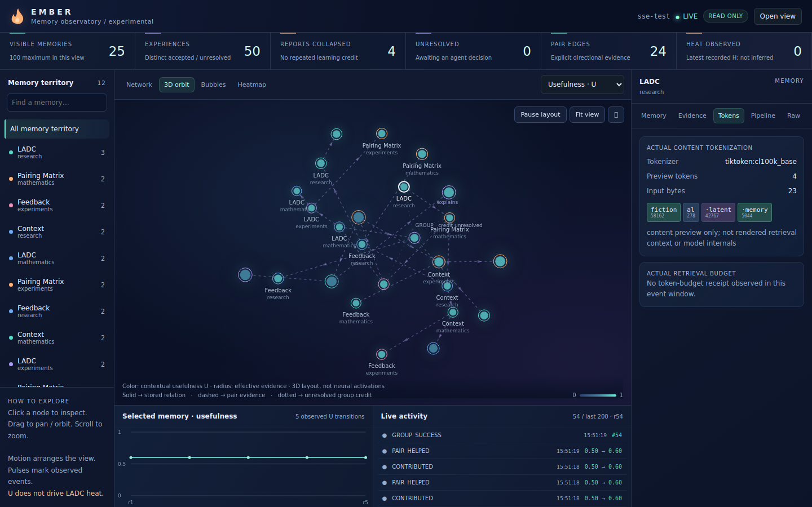
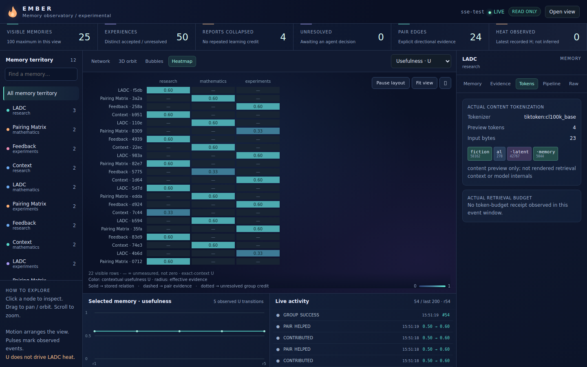

# Ember memory observatory

The existing `/visualizer` on the normal Ember server now uses a viewport-sized
Canvas interface. No second server, frontend build, CDN, or external scripts are
required. Pull the experimental branch and restart the normal server.

## Open a view through your agent

Ask: **“Create a read-only Ember visualization link for this namespace.”**

The agent calls the discoverable MCP tool `ember_visualizer_access`:

```json
{"namespace":"your-namespace","server_url":"https://your-ember-server","ttl_seconds":900}
```

The tool uses the agent's existing authentication. It returns a `code`,
`viewer_path`, `grant_id`, expiration, and (when the public origin is supplied)
`viewer_url`. `EMBER_PUBLIC_URL` can supply the origin instead. It never guesses
the public hostname. Without an origin, the code and relative path still work.

Open the link, or open `/visualizer` and enter the code. No namespace, agent ID,
or agent login token needs to be copied into the viewer. Advanced credential
access remains available for compatibility. Both stdio and HTTP MCP expose the
tool; HTTP clients can also use `POST /v1/visualizer-access`.

Codes default to 15 minutes and permit 60–3600 seconds. They grant read access
to one namespace, including its bounded memory previews and evidence. Treat a
code/link as temporary private viewing access. The issuing agent can revoke it:

```json
{"action":"revoke","grant_id":"the-issued-grant-id"}
```

## What the views mean

| View | Actual data shown |
| --- | --- |
| Network | Memories and directional stored relations/pair evidence; live affected-node pulses |
| 3D orbit | The same graph placed in XYZ coordinates, perspective projected; drag to rotate |
| Bubbles | Distinct stored subject/context groups and visible memory counts |
| Heatmap | Exact-context U or latest recorded H; missing measurements display a dash |
| Memory inspector | Preview, recorded truth status, U, effective evidence, last observed H and source |
| Evidence/event inspector | Reports, accepted/unresolved experiences, before/after changes, corrections and truth checks |
| Tokens | Real tokenizer IDs, decoded pieces and bytes from a bounded memory-content preview |
| Pipeline | Available stages, explicitly inactive components, diagnostics and bounds |
| Trend/activity | Recorded U transitions and ordered journal events |

Light traces highlight connections affected by a recorded event; they do not
claim the agent traversed an edge unless a receipt says so.

Motion is a force-directed **view layout**, not a neural activation, embedding,
semantic distance, memory decay, or proof of learning. Orbit is a 3D graph rendered
with Canvas 2D projection, not a model-internals viewer. Heat is available only
where an actual legacy Candidate 04 receipt recorded it. U never supplies H,
active/latent stages remain unavailable, and this change adds no U→LADC coupling.
Heat source, observation time and context remain inspectable. Truth is never
inferred from usefulness. Group outcomes retain unresolved individual credit.

Tokenization uses `tiktoken` with `EMBER_TOKEN_ENCODING` (default `cl100k_base`).
It describes the content preview, not an unobserved agent prompt or neural tokens.
Actual retrieval token counts/budgets are displayed separately when a Candidate
04 receipt provides them. The preview limits input to 4096 UTF-8 bytes and output
to 96 tokens, with explicit truncation flags and the actual tokenizer name.

## Interaction and screen fit

The graph owns the central viewport. Pan, orbit, zoom, pause layout, fit view or
enter fullscreen. Click a node/edge/event to inspect it. Keyboard focus on the
graph plus arrow keys selects visible memories. Context and text controls narrow
the view locally without writing to Ember. Reduced-motion preference starts the
layout paused. On phones, the inspector is a toggleable overlay. Only bounded
lists/inspectors scroll; the overall page does not need to scroll.

SSE continues to deliver committed journal changes and update stable node objects
in place. Connection state remains LIVE, RECONNECTING or POLLING FALLBACK.
Snapshot/event APIs remain the reconnect, missed-event and fallback path. The
persisted journal remains authoritative. The displayed event window is bounded
to 200 events, nodes to 100, and edges to 200; it is not an exhaustive store map.
Heatmap rows/columns additionally fit the available canvas; filtering permits
inspection of subsets. Selecting an event inspects its recorded before/after
state; it does not roll the live graph back in time.

## Read-only boundary

An agent explicitly issuing/revoking a grant writes small nonretrievable RAW
access records. Grant secrets are not stored: lookup uses their SHA-256 digest.
Opening a link removes its fragment before connecting and exchanges the code for
an HttpOnly, SameSite=Strict cookie (Secure under HTTPS). Exchange itself writes
no Ember records. Read routes independently verify namespace, expiry, revocation,
issuer namespace access and any bound active session. Streams repeat those checks
while connected. A viewing cookie cannot authorize memory writes, feedback or
new grants. Expired/revoked views clear their displayed private data.

Only the access exchange is a viewer POST; all memory/evidence/token/stream
requests are GETs. Session references are hashed in both snapshots and streams, including reconnect
recovery. No secret is included in delivery metadata. As with existing
authorized previews, content authored by users may itself contain sensitive text.

## Verification and limits

`tests/test_visualizer_access.py` covers code scope, expiry, revocation, persisted
grants after reopening, session closure, permission changes, no mutations on
exchange/read/stream, actual token IDs, retained measured H, and MCP discovery.
Existing usefulness and SSE tests cover learning invariants, event ordering,
namespace isolation, idempotence, durable commit and dropped connections.

Run `python -m pytest -q` and
`python examples/usefulness_sse_check.py --screenshot /tmp/observatory-orbit.png`.
The browser check starts an isolated normal server, tests live updates, restart,
catch-up, fallback, code/link access, revocation, all four views at desktop/laptop/
phone sizes, then checks a 25-memory graph with 24 pair relationships and a group.
Fixtures are synthetic research records persisted through real APIs.

This is an experimental bounded observatory, not a million-node renderer. Latest
heat lookup scans the existing journal once per snapshot; historical indexing is
future scaling work. Expired grant records remain in the append-only store under
its existing quota. Tokenization errors remain visible rather than substituted
with fabricated tokens. The user’s deployed server still needs its own live
validation after updating to this branch.

## Latest validation

- Full suite: **631 passed**, one dependency deprecation warning.
- Real-server Chromium: live delivery, idempotent updates, reconnection, restart,
  fallback/recovery, link and manual-code entry, revocation and replacement passed.
- Desktop 1440×900, laptop 1280×720 and phone 390×844: no page overflow; network
  and orbit node centers remained inside their canvas in the tested 25-node graph.
- All four modes and actual token inspection ran without browser JavaScript errors.
- Local isolated-store validation is complete; deployment/live user-store validation
  is pending. These screenshots contain synthetic fixtures, not user memories.




