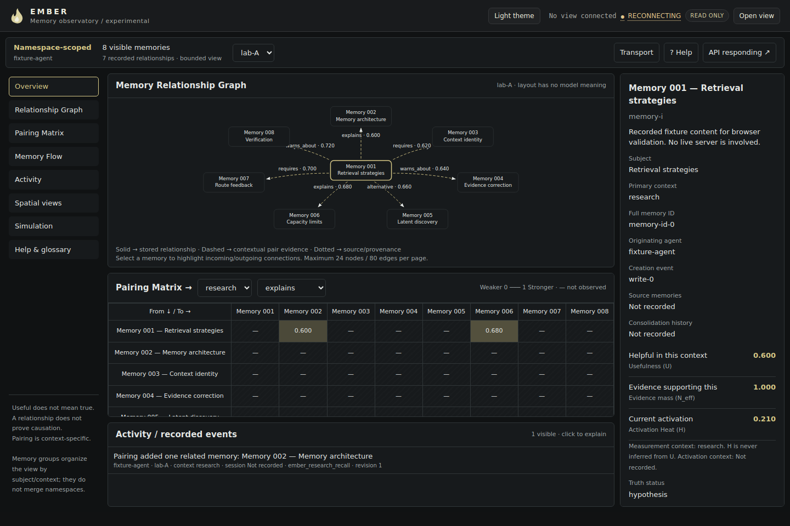
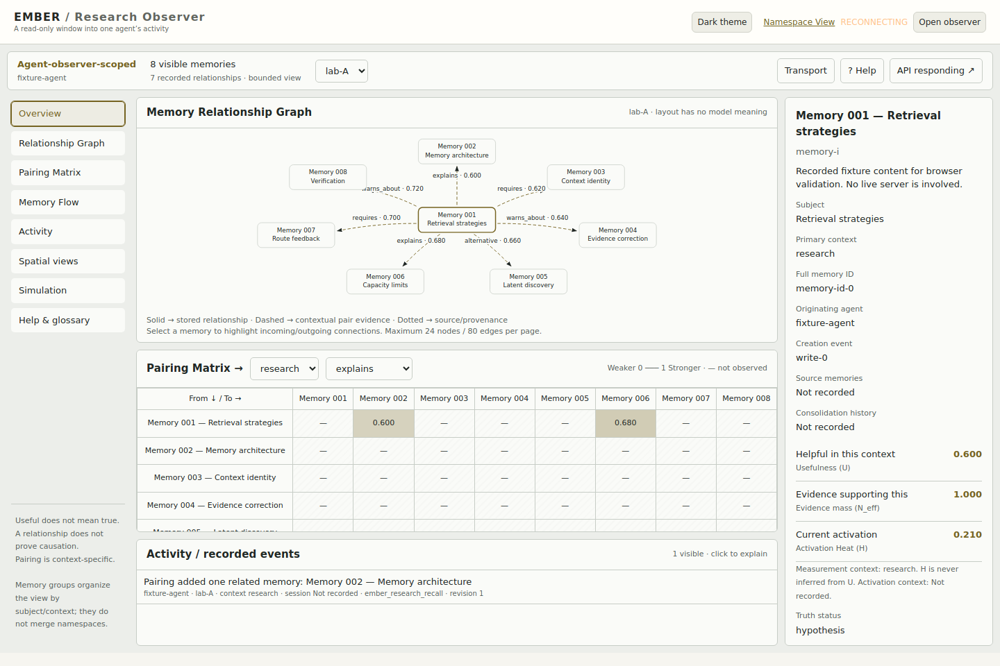
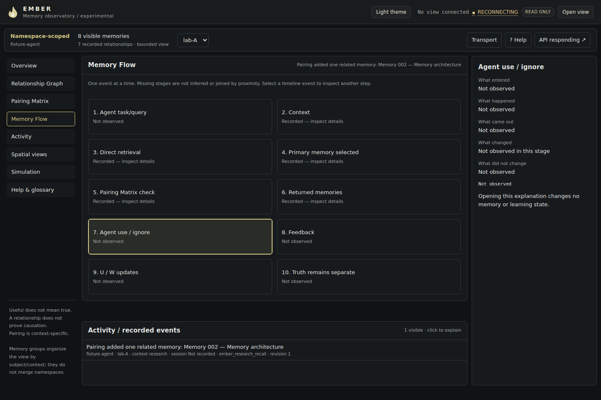
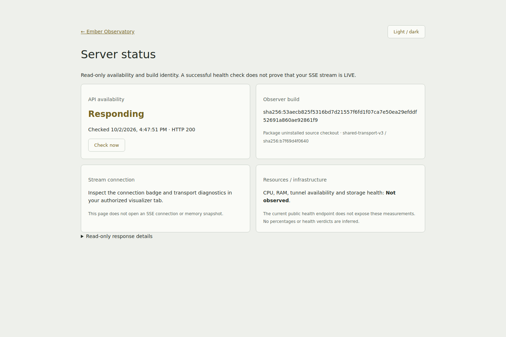

# Ember observation dashboard redesign

## Delivered

The existing namespace and agent-observer pages now share a presentation layer (`research_dashboard.js` / `.css`). The existing capability exchanges, native EventSource client, namespace authorization and replay remain unchanged. Templates embed the shared module through the existing asset/build renderer; packaging already includes these HTML/CSS/JS files.

- Overview combines a directional graph, contextual Pairing Matrix, selected-memory inspector and activity timeline.
- Relationship Graph uses friendly local labels (`Memory 001 — subject`), arrows, typed labels and distinct stored/pair/provenance styles. Selection highlights adjacent routes. Labels are local display aliases, never replacement IDs or new memory identity.
- Pairing Matrix selects exact recorded context and relation type. Rows are sources, columns are targets. Each cell uses one recorded W; there is no average W, relevance weighting or truth inference. Missing measurements are hatched/dashed rather than zero.
- Memory Flow explains ten clickable stages from a single recorded event. Missing stages remain Not observed. It does not join unrelated events or invent internal agent thinking.
- Inspector separates U, N_eff, actual H, edge-specific W, truth, provenance and recent activity. IDs remain available in full.
- Help/glossary explains scope, metrics and interpretation in plain English.
- **Simulation is live-data motion**, not fabricated fixture data. Only the layout moves. Pause and reduced-motion preferences are respected. No physics or learning is run against Ember.
- Existing bubble, activation heatmap and 3D views remain under Spatial views.
- A clickable API availability indicator opens `/status`. This read-only page checks `/health` and existing observer build metadata. It does not open another SSE stream. Health checks do not imply SSE LIVE.
- Dark/light themes and bounded panels keep desktop views within the screen, with internal scrolling for long lists/matrices. Narrow screens stack panels.

## Data and observation boundaries

Consumed data: namespace, observed actor, recorded session reference, context, memory IDs/subject/preview, provenance, typed relationships, contextual U/N_eff and W, recorded H, direct_ids, returned_ids, pair_expansion, journal event identity/revision and explicit before/after transitions.

The only observation projection addition is a whitelisted `feedback` object containing existing target, context, feedback_type and query_request_id. This makes pair feedback understandable in the observer without exposing credentials or inventing a second feedback mechanism.

No change to FUR, W, U, N_eff, Pairing selection, LADC, truth, context or memory state. No model functions were edited. No server was started or deployed.

Unavailable values are explicitly marked: unrecorded origins/sources, absent activation measurements, unobserved query/use/truth stages, and CPU/RAM/tunnel/storage health. The public health endpoint does not support an overall infrastructure-health claim. Relationship context absent from a stored-relationship projection is not inferred from endpoint memories.

Limits: graph pages show at most 24 nodes and 80 edges, matrix pages at most 12 × 12, observer presentation retains at most 500 nodes, 1,000 relationships and 200 events across authorized namespaces. Namespaces are selectable and remain distinct, including identical memory IDs across namespaces. The observer automatically follows the latest authorized event's namespace. Graph DOM nodes are reconciled in place on new observations.

## Validation

- Wording-only change: 40 focused tests passed; separately pushed as `4e58c126479b9373e17e115783e891e7adca859a`.
- Full suite: **706 passed**, one third-party TestClient deprecation warning.
- Final focused presentation/read-only gate: **3 passed**.
- Offline Chromium checks independently exercise the namespace adapter and observer event adapter: empty, one memory, disconnected, larger/dense graphs, exact relation selection, matrix cells, inspector, partial Memory Flow, both themes, 1440/1024/390px layouts, multi-namespace observer isolation and live motion without data changes.
- Browser assertion verifies the same graph DOM node survives a data update.
- No browser script errors; observed browser requests were GET-only. No listening server was used: page and endpoint responses were intercepted in the test browser. Screenshots contain labelled test fixtures, not deployed/live-server evidence.
- Viewer-only page, health, build and observer reads preserve persisted store and sidecar file hashes.
- Shared SSE client SHA-256 remains `b7f69d4f06405b066fee1e65e673100665d771131e13de58e7b03b1e2f0593c0`.

## Files

- `embers/api/research_dashboard.js`, `research_dashboard.css`: shared observation UI.
- `embers/api/visualizer.html`, `observer.html`, `observer_build.py`: presentation hooks and build identity.
- `embers/api/server_status.html`, `observer_routes.py`: read-only status page.
- `embers/integration/research_observer.py`: existing feedback fields projected for explanation only.
- `tests/test_research_dashboard.py`: read-only hashes, shared module/transport, corrected wording.
- `examples/research_dashboard_check.py`: reproducible offline browser validation.
- `docs/research-dashboard-evidence/`: browser results and selected screenshots.

## Screenshots

Live server validation remains pending. Install the changed packaged HTML/CSS/JS alongside the existing normal server on the test branch when ready; this task does not perform deployment.
