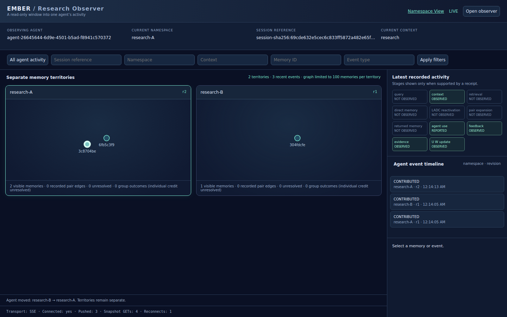

# Research Observer Mode — implementation and validation

## Outcome

The normal Ember server now offers two views:

- **Namespace View:** the existing deep view of one authorized namespace.
- **Research Observer View:** follows one explicitly consenting agent across its
  readable namespaces and, by default, across new sessions. No namespace entry is
  required from the human.

The implementation does not modify the Feedback Update Rule, U/W mathematics,
retrieval, context semantics, truth, LADC, pairing behavior, U→Q or U→H.

## Agent-facing operation

An authenticated agent calls `ember_visualize` with no namespace:

```json
{"server_url":"https://YOUR-NORMAL-EMBER-SERVER"}
```

Both HTTP MCP and stdio MCP expose the tool. `EMBER_PUBLIC_URL` can supply the
public origin instead. Without either, the result includes a relative viewer path
and code. The response includes `visualization_url` when the origin is available,
`observer_id`, `observed_agent_id`, `authorized_observer`, `scope`, `expires_at`,
`span_sessions`, `viewer_path` and the secret observation code.

The agent shares the link/code with the intended researcher. Opening it removes
the secret fragment from browser history and exchanges it for an HttpOnly,
SameSite=Strict cookie (Secure under HTTPS). It contains no agent login token.

To revoke, the same agent calls:

```json
{"action":"revoke","observer_id":"ID-FROM-CREATION"}
```

Default duration is one hour, configurable from 60 seconds to 24 hours. The
capability spans sessions unless `span_sessions:false` is requested with the
agent's active session. An optional namespace allowlist narrows the capability;
omitting it permits following future agent activity in namespaces the agent can
currently read. Permission is checked on the server every time data is collected.

## Authorization decisions

- Only the authenticated **self** can issue this observer capability. Supplying
  a different `observer_target` is rejected, even if the issuer has other rights.
- The authorized observer is the holder of the separately generated 192-bit
  bearer capability. Its distinct `authorized_observer` identity is recorded.
  This version does **not** authenticate a human account or named researcher.
  Anyone deliberately given the link can use that delegated scope until expiry
  or revocation; account-bound researcher login is not implemented.
- The capability grants only `agent-activity:read`, not ordinary Ember identity.
  Its cookie cannot authenticate memory writes, feedback, evidence resolutions,
  merge/split, retrieval, namespace snapshots, or creation of more capabilities.
- Selection requires both the recorded event actor to equal the observed agent
  and the namespace to remain readable by that agent. Optional capability
  namespace/session restrictions apply before the visual filters and serialization.
- Existing namespace visualizer capabilities gain no additional permissions.
- Grant and revocation metadata persist in an owner-protected sidecar directory
  beside the store (`<store-name>-observer-access`). Plain secret codes are not
  stored; filenames use their SHA-256 digest. These records never enter the memory
  store, retrieval indexes, evidence journal or learning state. They survive a
  normal server restart. Expired sidecars are retained; automatic cleanup is not
  part of this change.

## Endpoints

| Surface | Behavior |
| --- | --- |
| MCP `ember_visualize` | Authenticated self-only issue/revoke; no namespace required |
| `POST /v1/observer-access` | Same issue/revoke behavior through the normal API |
| `POST /v1/observer/exchange` | Read-only code lookup and cookie exchange; no Ember writes |
| `GET /v1/observer/events` | Authorized bounded initial/catch-up page |
| `GET /v1/observer/stream` | Authorized resumable SSE, protocol `ember-agent-observer.v1` |
| `/visualizer?mode=observer` | Human research observer interface |
| `/visualizer` | Existing Namespace View, unchanged semantics |

## Journal and stream semantics

The existing committed-journal notification now also wakes store-level observer
subscribers. Wakeups carry no memory data or credentials. The observer selects
and projects permitted events from the persisted journal before sending anything.
It does not copy namespace state into a new memory space or create another journal.

The SSE response starts with `event: ready`. Subsequent `event: observer` frames
contain bounded event batches and a cursor. The cursor is a **vector of namespace
journal revisions**, tied to this observer ID. Each actual event retains its own
namespace, persisted revision and event ID. There is no invented global revision.

Within each namespace, revisions remain ordered even if wall-clock timestamps
move backwards. Cross-namespace interleaving uses recorded times among the next
available events; it is not a globally transactional chronology. Gaps in an
agent-filtered namespace revision sequence can legitimately be other-agent events.
Those other-agent events are not transmitted.

Issuing the capability captures a per-namespace baseline. Default observation
starts **after capability creation**, rather than disclosing all prior history.
Reconnect and filter replay retain that baseline. New namespaces begin at their
first permitted event. Browser deduplication uses per-namespace revision watermarks
as well as event identity, including after its visible timeline is trimmed.

Healthy SSE does not poll snapshot endpoints. Initial load, filter changes,
reconnection and explicit fallback can read bounded catch-up pages. Bad or stalled
connections show RECONNECTING; repeated failures show POLLING FALLBACK. LIVE
requires the actual SSE ready frame. Diagnostics expose actual push counts,
snapshot GET counts and reconnects through the UI and `window.emberObserverTransport`.

Immediate commit wakeup is verified for the normal single-process server and its
HTTP MCP/API writers. Other-process writes retain the existing one-second
server-side journal reconciliation. No second server or permanent client poller
is introduced.

## Metadata and graph boundaries

Projected events expose actual agent, namespace, request, recorded timestamp,
event identity/type, context, affected memory/experience IDs, U/N_eff/W before/after
when present, and actual recorded H with its source. Session IDs are bearer
credentials in Ember, so **stable SHA-256 session references replace raw session
IDs**. The researcher can correlate/filter sessions without gaining their authority.

Each namespace owns a separate graph container and separate keyed node/edge maps.
Only recorded W targets whose endpoints are present in that same namespace create
pair edges. Group outcomes stay group outcomes; no individual credit or connection
is invented. Panels show observed unresolved/group state, not a recomputed model.
Memory previews are authorized current record reads, not a reconstruction of the
memory text at an old event's timestamp.

Activity filters (all/session/namespace/context/memory/event type) are server-side
read filters. The namespace can be selected from already observed options; the
human never needs it to open the observer. With a filter active, the activity header
reflects the latest **matching** event. Changing a filter resets/replays only the
browser's bounded view, with no Ember command or learning update.

The pipeline marks query, context, retrieval completion, returned memories,
reported use, feedback, evidence and U/W changes only when receipts support them.
A claimed useful memory is labelled **REPORTED** for agent use. Direct retrieval,
LADC reactivation and pair expansion remain **NOT OBSERVED** unless an explicit
stage receipt is available; this version does not infer those stages from heat,
U, stored relations or a final retrieval result.

## Bounds and known limits

- At most 128 namespaces per capability cursor; exceeding this is explicit failure,
  not silent checkpoint loss. A narrower agent-issued scope is then required.
- Up to 20 events per default page (50 maximum in the SDK), 500 candidate events
  examined per page merge, 32 KiB projected event and 256 KiB page budget.
- Memory previews are 500 characters; event detail collections are capped at 100.
  Oversized events retain identity/revision with `details_omitted:true`.
- Browser timeline: 200 recent events. Per territory: 100 nodes, 200 pair edges
  and 200 experience summaries. These are observation limits, not store quotas.
- Journal discovery currently scans committed journal records. It does not add an
  observer index to the memory system. A very large store can increase observation
  latency; no zero-CPU/I/O-overhead claim is made.
- Only actions already represented in the existing observable journal appear.
  A bare memory write or session opening does not manufacture a new feedback event.
  Session movement becomes visible on the agent's next recorded operation.
- Observer inspection is limited to the permitted event projection and previews;
  it cannot fetch arbitrary namespace records or invoke agent retrieval.

## Zero-mutation evidence and acceptance results

Full automated suite: **641 passed**, one dependency deprecation warning.
Eight observer tests cover scoped delegation, expiry/revocation, session binding,
namespace permission changes, cursor ownership, paging/order, restart persistence,
MCP discovery, rejected mutation APIs and unchanged memory-store file hashes.
A stream test uses a one-hour reconciliation interval and still receives the
committed event within one second, proving a commit wakeup.

`examples/research_observer_check.py` starts an isolated **normal server** and a real
Chromium browser. It demonstrates:

1. Agent issues one observer link; human enters no namespace.
2. Same browser follows research-A → research-B → research-A.
3. Two distinct agent sessions are observed under the same capability.
4. Existing A graph DOM remains in place when B appears; territories stay separate.
5. Raw SSE contains the observed agent's permitted events, excluding another
   agent's events both in shared B and in a separate namespace.
6. No snapshot GET occurs during a 6.2-second healthy-stream window.
7. Duplicate application, actual server restart and catch-up preserve one event
   application per namespace revision.
8. Inspection/filter changes and idle observation leave every memory-store file
   unchanged. Even capability issue/revoke leave the memory store unchanged.
9. Revocation clears the view. Desktop and phone layouts stay within the viewport.

[Raw SSE and measured acceptance proof](research-observer-proof.json) contains the
actual isolated test data, not a live-production claim. No credentials or raw
session IDs are included. The screenshot contains fictional records.



**Deployed validation remains pending** after updating/restarting the user's normal
server. No existing live namespace or revision-48 evidence was touched.
