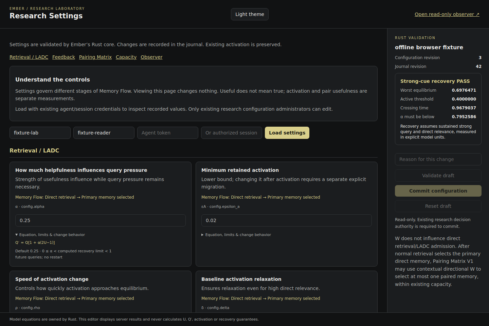
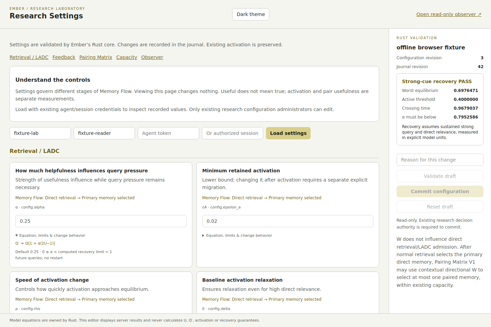

# Educational Research Settings

Implemented on the existing test branch, normal `/research/settings` page. No server started or deployed.

## Behavior

- Plain-English names/explanations precede symbols and values. Equations, validation ranges and change behavior are expandable.
- Groups: Retrieval / LADC, Feedback, Pairing Matrix, Capacity, Observer. Each setting identifies its Memory Flow stage.
- Charcoal/gray with faint yellow accents, light theme, internally scrolling desktop panels and responsive narrow layout.
- Existing configuration and journal revisions are displayed. The existing settings GET additionally projects the newest 30 configuration changes, newest first, with a truncation indicator. History contains only existing recorded metadata and config/policy snapshots. No new persistence system.
- Frozen Pairing V1 description: first admitted direct seed, no W effect on direct admission, contextual accepted W above neutral, already-direct targets excluded, highest W, stable ties, maximum one hop/addition, winner checked against existing capacity without substitution.
- Research dashboard links to `/research/settings?mode=observer`. This educational mode makes no configuration API calls and has no editing controls. Existing observer capabilities do not authorize configuration reads: actual revision/values/history remain **Not observed** here. Authorized readers/editors use the existing `/research/settings` credential form. No access scope was broadened.
- Existing editor uses the same Rust validator, administrator authorization, reason, request ID and expected journal revision. Changing credentials invalidates displayed authority and draft; stale read/validation responses are discarded.
- Observer settings are informational: the existing research schema defines no observer controls. Grant scope/expiration remain in existing viewing access.

## Files

- `embers/api/research_settings.html`: educational layout and existing editor UI.
- `embers/api/research_dashboard.js`: guide link only; live simulation continues to animate actual observation data.
- `embers/integration/research_schema.py`: descriptive names/groups/stage metadata only; no values/equations changed.
- `embers/integration/consolidated.py`: bounded read-only journal history projection in settings response.
- `tests/test_consolidated.py`: history/restart/read-only/authorization checks.
- `examples/research_settings_check.py`: offline browser checks.
- `docs/research-dashboard-evidence/settings-*`: reproducible offline fixture screenshots/results.

## Validation

- Full suite: **708 passed**, one external Starlette TestClient deprecation warning, 38.95 seconds.
- Focused settings/dashboard suite: **13 passed**.
- Offline Chromium: observer zero configuration requests; reader zero POSTs; disabled read-only fields; revision/history; details; dark/light; 1440/1024/390 widths; authorized draft validation; credential-change invalidation. No browser errors.
- Existing observer cookie rejected by settings GET/POST (401); non-admin agent rejected by config POST (403).
- Reading history leaves persisted store file hashes unchanged. History survives reopen. Configuration, FUR and activation unchanged by reads.
- Existing authorized configure/CAS/Rust validation/restart tests pass.
- Shared SSE transport SHA remains `b7f69d4f06405b066fee1e65e673100665d771131e13de58e7b03b1e2f0593c0`.

Screenshots are **offline fixtures**, not deployed validation. No live server, SSE soak or deployment is claimed in this change. The preceding dashboard implementation is published as `2b5ea7099070cb28383d5aa0d50841bbadb36dff`; wording-only fix is `4e58c126479b9373e17e115783e891e7adca859a`.

