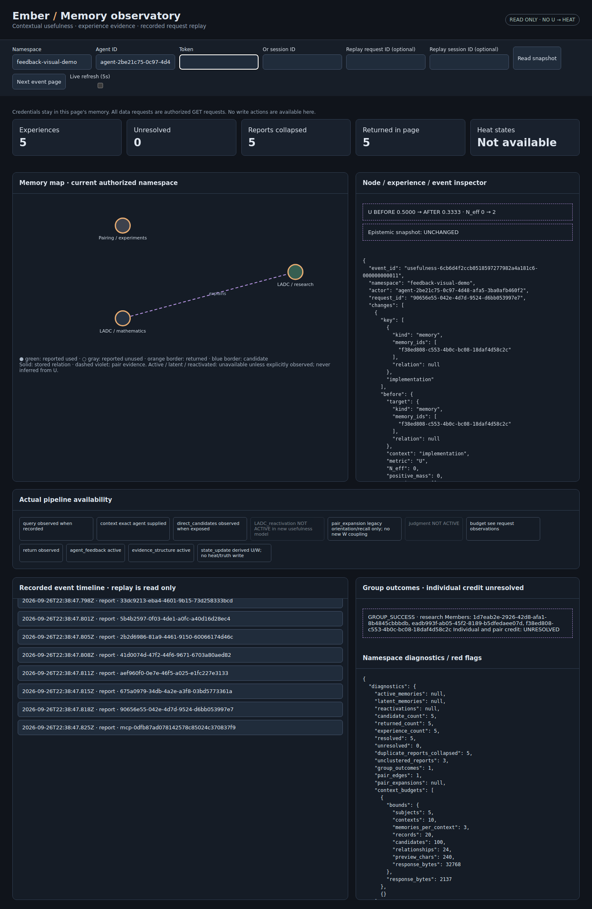

# Evidence-derived usefulness and live visualizer

Experimental V0 delivery on `codex/ember-split-feedback-candidate04` (PR #31).
This document describes this commit's implementation, not a production-readiness
claim or a final research model. Contracts 01 and 02 retain their retrieval and
context semantics. No second server is introduced.

## What changed, in plain English

Ember now keeps feedback reports in an experience ledger. Five reports about
one known outcome are five pieces of history, but only one learning experience.
Usefulness is calculated from the currently accepted experiences. Correcting an
old experience therefore corrects its contribution, even after later feedback.

A memory can be useful in one exact context and unhelpful in another. Pair
feedback is directional and separate. A group result gives no invented credit
to its members. Being unhelpful does not make a memory false.

The browser view shows memories, relationships, feedback, duplicates, corrections
and before/after values. It only reads. Unknown heat/stage information is labeled
unavailable. **This U/W model does not change recall ranking, heat, LADC or truth.**
The older Candidate 04 APIs still exist independently; `ember_feedback` and
`ember_resolve_relevance` do not write this new evidence ledger.

## Start and inspect

Use the existing normal startup:

```bash
python -m uvicorn embers.api:app --host 127.0.0.1 --port 9200
```

Open `http://127.0.0.1:9200/visualizer`. Enter an authorized namespace and agent
credentials, or an existing active session credential. The existing bootstrap
credential file is adjacent to the store: `<store-name>-candidate-credentials.json`.
That existing dedicated agent is also the decision agent for this experiment.
Namespace permissions still apply to it. Other namespace writers may submit
ordinary reports but cannot attest identities, correct, merge, split or configure.
No extra configuration file is required for the defaults.

The page can refresh every five seconds. Select an event to see **U BEFORE /
AFTER**, **N_eff BEFORE / AFTER**, and the unchanged epistemic snapshot. Select a
node for its current evidence, recorded retrieval reasons and edges. Request and
session filters apply to the event stream; the map remains a **current-state**
map, not a fabricated historical reconstruction. Next-page reads advance a journal
revision cursor. Replay never executes the stored operations.



## Interfaces and examples

| Interface | Behavior |
|---|---|
| `POST /v1/usefulness/{namespace}` | Report or authorized evidence decision |
| `GET /v1/visualizer/{namespace}` | Authorized bounded read; `after`, `limit`, optional `request_id`, `session_id` filters |
| `GET /visualizer` | Public static shell; contains no memory data |
| `ember_usefulness_update` | MCP equivalent of the mutation endpoint |
| `ember_usefulness_state` | MCP snapshot; optional `request_id` and `filter_session_id` filters |

REST uses the existing `X-Ember-Agent-Id` + `X-Ember-Token`, or
`X-Ember-Session-Id`, authentication. MCP uses existing agent/session arguments.
Auth/session fields do not go in the JSON examples below.

Ordinary report:

```json
{
  "action": "report",
  "request_id": "unique-submission-id",
  "payload": {
    "target": {"kind": "memory", "memory_ids": ["existing-memory-id"]},
    "context": "LADC research",
    "feedback_type": "CONTRIBUTED",
    "query_request_id": "optional-query-correlation-id",
    "note": "Prevented repeating a failed experiment"
  }
}
```

MCP additionally requires `namespace` at the top level. Exact `context: null`
means explicitly unset. Pair targets use `kind: "pair"`, ordered IDs `[A,B]`,
and `relation: "explains" | "requires" | "warns_about" | "alternative"`.
Their feedback types are `PAIR_HELPED`, `PAIR_IRRELEVANT`, `UNUSED`.
Group targets use `kind: "group"` and a set of member IDs; types are
`GROUP_SUCCESS`, `GROUP_FAILURE`, `UNUSED`.

An authorized decision agent can additionally attest a report identity:

```json
{
  "identity": {
    "value": "ticket-481",
    "source": "ticket-system",
    "provenance": "Agent inspected the final ticket outcome"
  },
  "identity_verified": true
}
```

These fields go in `payload`. Attestation means **the configured agent asserted
identity**, not that Ember independently proved it. Ordinary unverified identity
claims are stored for inspection but do not become authoritative deduplication
keys. An explicit active `experience_id` can attach a report to that exact
experience, provided its target/context match; this is a caller's explicit
association, not semantic inference by Ember.

Decision example, using the latest `revision` from a snapshot:

```json
{
  "action": "resolve",
  "request_id": "correction-481-v2",
  "expected_revision": 17,
  "payload": {
    "experience_id": "returned-experience-id",
    "status": "accepted",
    "feedback_type": "UNUSED",
    "reason": "The earlier attribution was mistaken"
  }
}
```

`status: "unresolved"` requires `feedback_type: null`. Merge payload:
`{"experience_ids":["C1","C2"],"reason":"same underlying result"}`.
Split payload: `{"experience_id":"C","partitions":[["report1"],["report2"]],
"reason":"actually two outcomes"}`. Every old report must occur exactly once.
All decisions require a new request ID, current revision, and reason. Observation
events also advance revision, so a stale decision must be reviewed and retried.
An identical actor/request-ID retry returns the original event, including after
restart. Reusing the ID for different input fails.

## Formula and parameters

For exact `(memory version ID, context)`:

```
N_eff = sum(A_C)
positive_mass = sum(A_C * y_C)
U = epsilon + (u_max - epsilon) *
    (kappa_u * u0 + positive_mass) / (kappa_u + N_eff)
```

Only active, accepted, non-UNUSED experiences contribute. Each ordinary
experience has credit one before typed severity. CONTRIBUTED has y=1;
IRRELEVANT/MISLEADING have y=0. Unresolved evidence and UNUSED have weight zero.
The same family produces W for `(A, B, relation type, exact context)`, using
`kappa_w`, `w0` and range [0,1]. It never updates U or a stored graph edge.

| Setting | Test default | Meaning |
|---|---:|---|
| `kappa_u`, `kappa_w` | 4 | Prior strengths |
| `u0`, `w0` | 0.5 | Prior fractions |
| `epsilon`, `u_max` | 0, 1 | U range |
| `severity.contributed` | 1 | Positive evidence weight |
| `severity.irrelevant` | 1 | Ordinary negative weight |
| `severity.misleading` | 2 | Contextual harm weight; must exceed irrelevant |
| `cluster.session_window` | 1800 | Seconds from first report, with a real active session |
| `cluster.time_window` | 60 | Seconds from first report, without a session |

All values are experimental settings. Windows must be in [0,86400]; zero disables
that structural path. Initial values can be supplied using `EMBER_USEFULNESS_CONFIG`
pointing to a JSON object with these fields. Alternatively use SDK `UsefulnessPolicy`.
After a namespace has journal history its policy is persisted; changing startup
configuration does not silently reinterpret that history. An authorized
`configure` operation with `payload: {"policy": {...}, "reason": "..."}` explicitly
recomputes all derived values under the new policy and records the changes.

With positive finite prior strength and nonnegative finite weights, the fraction
is a weighted average of a prior in [0,1] and outcomes in {0,1}. Hence U stays in
[epsilon,u_max] and W in [0,1]. Repeating the same accepted experience changes
neither sum. Corrections recompute the sums, so no old bump survives. This is an
algebraic guarantee of the specified rule, not a machine-checked proof, proof of
semantic attribution, or convergence under every possible feedback sequence.

## Identity, correction and evidence decisions

Attested `(source,value)` identity is scoped to target and exact context, and
can collapse reports across agents/sessions. Otherwise structural clustering
requires the same actor, exact target/context, same actual session (or no session),
and elapsed time within the applicable first-report-anchored window. Query
wording does not participate. The window does not slide forever with new reports.

Several identical reports contribute once. Different non-UNUSED types in the
same experience make it unresolved; there is no vote. UNUSED remains telemetry
and does not invalidate an explicit correction. A later non-UNUSED report on a
manually resolved experience reopens it for review rather than silently retaining
a decision that predates new testimony. An authorized resolution then selects
the effective type or keeps the experience unresolved.

Merge/split deactivate old experiences, preserve reports/history and derive new
active sets. Merges retain prior attested identity aliases. If a split leaves a
reliable identity associated with multiple children, future reports must name
an explicit child experience rather than being silently assigned. Cross-target
or cross-context merges are rejected. Group sets are sorted; pair order is not.

## Storage and truth boundary

New namespace-scoped RAW records carry `ember.usefulness-evidence.v1` events.
They are marked non-retrievable/non-training. Each event has sequence, actor,
request fingerprint, prior seal, policy, changed experience snapshots, optional
report, U/W transitions and source/truth fingerprints. New events append under
the native writer lock and existing total-store quota. Replay reconstructs state
from persisted events, validates sequence/content/hash chain, and fails closed on
observed history corruption. There is no destructive schema migration.

Experiences retain target, exact context, immutable report IDs, resolved type,
status, active/replaced status, identity provenance, timestamps and parent IDs.
Reports retain actor, session, query correlation, typed feedback, identity claim
and note. Group evidence uses its own target kind and produces no individual or
pair states. N_eff and per-experience effective weights accompany every U/W state.

The usefulness mutation module's sole persistence call creates a **new RAW
journal record**. It never passes a source memory to an update/annotation/link
writer. Source content, annotations and epistemic fingerprints are checked
around the append; a mismatch raises a severe error. F16 wraps the writer to
reject any source-memory write and compares complete source records afterwards.
This establishes the code-path firewall for this implementation. It is not a
security sandbox against malicious Python code with direct database access.
Journal truth-after fields express the invariant expected at commit, checked
immediately after append; they are not a separate external truth adjudication.

The journal cache validates newly encountered records; restart validates the
whole chain. It is not a continuous rehash of already-cached physical files.
Existing lifecycle/truth code remains separate and can independently change a
memory for its own reasons. Nothing here manufactures correctness evidence.

## Visualizer, observability and limits

The static page uses same-origin authorized GETs only, no external scripts and
no browser persistent credential storage. All namespace checks occur server-side
before state enumeration. Graph endpoints must both be in the authorized visible
namespace. The page sends no mutation requests; event selection is local replay.
GET responses are `no-store`. Failed reads clear previously displayed data.

Normal authenticated REST/MCP recall, orientation and Candidate 04 recall record
completion observations, without changing their response shapes. These contain
query/context, bounded returned/candidate IDs, exposed signals, budgets, latency
and session. Token credentials are never copied. Session task is included only
when available in the same namespace and owned by the caller. Goal/constraints
are unavailable on current request APIs. SDK-only recall/orient remain unchanged.
Observability appends internal audit records; it does not rewrite memories,
contexts, relationships, heat or usefulness. If audit persistence fails, the
retrieval still succeeds and the server logs the missing observation.

The UI distinguishes ordinary relations from dashed pair-evidence edges, and
historical individual used/unused reports from candidate/returned membership.
A group result does not color individual members successful. W evidence does
not imply an edge was traversed. Traversal/use-per-request remains unavailable
unless existing observations actually expose it. Legacy Candidate 04 structured
receipts may supply heat; the new model's active/latent/reactivated flags are
unavailable and are never inferred from U.

Limits: 100 nodes, 200 edges (at most 100 ordinary), 100 state/experience summaries,
200 report summaries, 1–200 events per page (default 100), 500-character previews,
256 KiB JSON snapshot ceiling. Nested event summaries retain at most 20 changed
experiences/transitions, 20 report IDs per experience and 20 evidence components
per transition. Counts indicate truncation. Full immutable event data is available
through the authorized SDK `ledger.events`; HTTP/MCP event pages retain each
report's own original submission event. A too-large event gets a minimal summary
and advances the cursor. The UI is a bounded inspection view, not a full export.

Diagnostics include namespace experience/report counts, unresolved states,
duplicate collapse, U/N_eff distributions, groups, pair feedback/edges, observed
budgets/latencies and logical canonical-JSON ledger bytes. Physical/global storage
and quota values are withheld from namespace readers. Unavailable heat/expansion
counts are null. Flags expose unresolved piles, repeated reports, identity
ambiguity, UNUSED telemetry, repetitive growth for review, and severe observable
truth/context invariant violations. Growth flags show raw gain and elapsed time;
no scientifically validated suspicious-growth classifier is claimed.

## Unspecified choices made explicitly

| Choice | Implemented baseline |
|---|---|
| Decision authority | Existing dedicated bootstrap agent; SDK can supply an explicit admin set, still namespace-authorized |
| Outcome identity authority | Explicit authorized agent attestation, never automatic trust in a label |
| Structural grouping | Actor + target + exact context + active session + anchored time window; no session uses a shorter window |
| Conflicts | Any disagreement among non-UNUSED types unresolved; no majority |
| Late testimony | New non-UNUSED report reopens manual resolution; UNUSED does not |
| Explicit association | Writer may attach to an existing matching experience by ID; association is recorded as a report claim |
| Pair types and priors | Four explicit directional types, separate typed W, kappa_w=4/w0=.5; pair severities reuse positive/ordinary-negative settings |
| Version/context identity | Exact memory-version ID and exact string or null; no automatic transfer to a replacement memory |
| Decision concurrency | Namespace journal revision CAS, including observation events |
| Policy changes | Explicit audited full evidence-set recomputation |
| Input bounds | 16 KiB command payload, identifiers/context up to 512 UTF-8 bytes, group up to 32 unique current durable memories, merge up to 100 experiences |
| Snapshot selection | Bounded current-state summaries plus chronological event pages; explicit omissions, not full graph loading in the browser |
| Diagnostics | Raw measures and review flags, no calibrated anomaly threshold or truth judgment |

## Validation and remaining limits

`tests/test_usefulness.py` covers all F01–F24 behaviors, plus persisted replay,
idempotent retry, policy recomputation, session identity validation, request/session
filters, cross-namespace edges, and authenticated REST/MCP operations. F01–F03
use real native writes for 1, 10 and 100 outcomes; F11 writes 1,000 UNUSED reports.
Corrections, merges and splits exercise persisted experience history, not just
standalone arithmetic. Contracts 01/02 retain their regression suites.

A reproducible **write-producing** live check for an isolated test namespace:

```bash
python examples/usefulness_live_check.py \
  --url http://127.0.0.1:9200 \
  --credentials /path/to/store-candidate-credentials.json \
  --namespace isolated-feedback-test
```

It needs `httpx`. Add `--screenshot /path/to/output.png` with Playwright and an
installed Chromium browser to check real DOM rendering, clicks, zero browser
mutation requests and a screenshot. It uses fictional data and leaves that
history intact. Use a namespace you own; this script does not alter namespace ACLs.

Remaining limitations and deliberate boundaries:

- Structurally undetectable duplicates across actors/sessions/times may receive
  multiple credits. Semantic identity and generalized trust scoring are not built.
- Full history replay, state recomputation and some native graph reads are not
  constant-time. Event snapshots can grow quadratically with report/history size.
  Existing storage quotas constrain writes; research-scale tests do not establish
  million-record throughput, retention/compaction or production readiness.
- Pipeline observations are completion snapshots, not fabricated timestamps for
  every internal stage. Requests before instrumentation or failed audit writes
  have no reconstructed timeline. Filtered replay is observational, not re-execution.
- UI summaries truncate large history/state; full export/search across all evidence
  is not implemented. Internal snapshot work still scales with ledger size.
- No final LADC formula, U→Q coupling, group credit assignment, context transfer,
  semantic deduplication, truth inference or new pairing-driven retrieval is added.
- User-managed live-server validation remains a separate step from the isolated
  normal-server HTTP/browser validation performed here.

## Delivery verification and changed files

Final automated run: `python3 -m pytest -q --disable-warnings` — **615 passed,
1 warning, 29.64 seconds**. This includes all 590 pre-existing tests and 25 new
parameterized test cases covering F01–F24 and additional safeguards.

Normal `uvicorn embers.api:app` HTTP/browser smoke check: **PASS**.
The real `/mcp` endpoint completed initialization, advertised both new tools
through `tools/list`, accepted `ember_usefulness_update`, and returned the new
state through `ember_usefulness_state`. Tool schemas describe report targets,
feedback types, identity provenance, corrections, merge/split and configuration. Three fictional
memories, five duplicate reports, explicit pair feedback, group success, UNUSED,
and MISLEADING in a different context were inspected. One trusted duplicate
experience stayed U=0.60 / N_eff=1. All source truth statuses remained hypothesis.
Chromium rendered the real page, node/event clicks worked without JavaScript
errors, all browser requests were GET, and the journal revision did not change
while viewing. Screenshot is above. A full server process stop/start then returned
an identical authorized state/observation snapshot: **PASS**.

| Files | Change |
|---|---|
| `embers/cognitive/usefulness.py` | Formula, policy, immutable reports/experiences, decisions, replay and firewall |
| `embers/integration/usefulness_service.py` | Authorized service adapters, observations, bounded snapshots and diagnostics |
| `embers/api/usefulness_routes.py`, `embers/api/visualizer.html` | HTTP mutations, protected reads and read-only browser interface |
| `embers/api/session_gate.py` | Registers routes on existing app |
| `embers/api/v1.py`, `embers/api/feedback_routes.py` | Records existing retrieval completion observations |
| `embers/integration/server_memory.py` | Enables usefulness during normal bootstrap using existing decision identity |
| `embers/mcp/server.py`, `embers/mcp/tools.py` | Two new MCP tools and existing-request observation plumbing |
| `tests/test_usefulness.py` | Native-store, REST/MCP, authorization, replay and behavioral tests |
| `examples/usefulness_live_check.py` | Reproducible explicit live write/browser smoke test |
| `pyproject.toml` | Includes HTML asset in wheel/source packages; wheel build not separately exercised here |
| `README.md`, this document, `docs/usefulness-visualizer.png` | Startup guidance, implementation report and actual rendered view |

The exact published commit is supplied in the delivery response; the report and
code travel together on the existing experimental branch. No main-branch merge
or deployment to your separately running server was performed.
