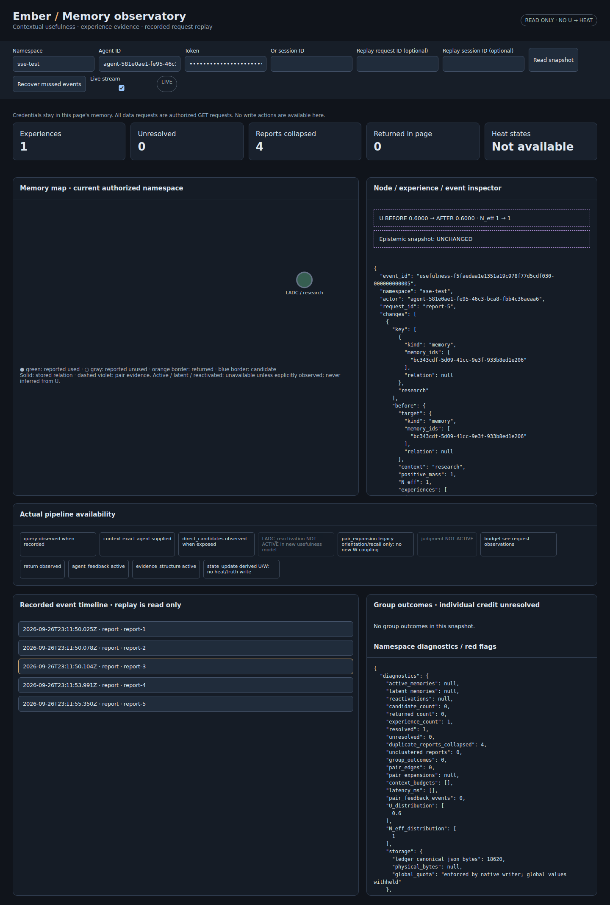

# Live visualizer: SSE observation delivery

The existing normal Ember server now pushes committed observations to the browser.
The visualizer remains read-only. There is no new server, no heat inference from
usefulness, and no U→LADC coupling.

## Use

Pull this experimental branch and restart the normal server. Open `/visualizer`,
enter existing namespace credentials, and choose **Read snapshot**. Live streaming
is enabled by default. The visible status is **LIVE**, **RECONNECTING**, or
**POLLING FALLBACK**. New/affected nodes, edges and timeline entries pulse briefly.

For a bounded graceful restart while SSE clients are still connected, use:

```bash
python -m uvicorn embers.api:app --port 9200 --timeout-graceful-shutdown 2
```

SSE is a long-lived HTTP connection; an unlimited graceful-shutdown wait can wait
for connected browsers indefinitely. A bounded shutdown timeout closes those
connections, and their revision-based reconnect recovers committed events.



## Wire contract

`GET /v1/visualizer-stream/{namespace}?after=REVISION`

Existing agent/token or active-session authentication is required in headers.
A `Last-Event-ID` header, when supplied, takes precedence over `after`. Invalid,
negative or ahead-of-journal cursors are rejected; the server never silently
rewinds a cursor. Namespace read authorization and credentials are rechecked
before each delivery and during idle heartbeats. A supplied session must belong
to the authenticated actor and remain active.

The browser uses streaming `fetch`, allowing authentication headers without
putting credentials in URLs. Frames use normal SSE syntax:

```text
id: 17
event: patch
data: {"collections":{...},"events":[...],"meta":{...}}
```

The SSE ID is the last journal revision included in that frame, not a transient
connection counter. Each frame contains up to 20 ordered journal event summaries,
collection upserts/removals and bounded snapshot metadata. Collections include
nodes, edges, derived states, experiences and reports. The first stream frame
may initialize its bounded view; subsequent frames contain changed collection
items only. As with snapshots, the current-state map may already reflect a later
committed revision than the event page; `meta.revision` identifies that current
state, while the SSE ID acknowledges only the delivered event prefix.

No authentication token is copied into an event. The delivery layer removes token
fields, replaces session-ID fields with `session-sha256:` correlation references,
and redacts the connection's actual token/session credential if it occurs in
serialized content. Agent IDs are public identities, not tokens. Hash references
preserve session grouping without sending bearer session IDs over the stream.
Session filtering accepts these references; on secure browser origins it can
also hash an entered raw session ID locally. Existing authenticated snapshot
responses keep their existing schema and session visibility.

## Commit, reconnect and failure behavior

The journal append hook wakes namespace listeners only after the native writer
returns successfully and the ledger incorporates the event. Wakeups carry no
memory/event contents. Consumers always read the persisted journal; the stream
is not an authoritative store or an alternative feedback path. Identical mutation
retries append nothing and produce no new journal revision.

The experimental single-worker normal-server path wakes waiting clients directly
on commit. Notifications are coalesced, so a slow client catches up from the
journal rather than accumulating an unbounded message queue. A one-second idle
journal check also covers missed wakeups and writes from another process. Thus
**cross-process writers have up to the heartbeat interval of discovery latency**;
this baseline does not claim an immediate distributed notification bus. Local
push latency additionally depends on storage, snapshot computation, network and
browser scheduling.

Snapshots are now read under the writer lock so state, event pages and revision
metadata describe a consistent committed prefix. Viewing snapshots or streams
only reads; listener bookkeeping is transient process memory.

The browser confirms a revision only after parsing and applying the complete
frame. It ignores already-confirmed frame IDs, checks contiguous event revisions,
and recovers gaps from the existing authenticated bounded snapshot endpoint.
Partial frames on a dropped connection remain unconfirmed. On connection failure,
the browser catches up, retries SSE with backoff, and after repeated failures
visibly enters polling fallback. It continues attempting SSE and returns to LIVE
when streaming works again. A stalled connection has a 15-second watchdog.
Authorization denial stops delivery and clears displayed private state.

Keyed DOM reconciliation preserves existing node/edge/event elements. The browser
updates their attributes/content in place and appends new events, rather than
rebuilding the entire visible graph every five seconds. Its event window is
bounded to the latest 200 processed events; full persisted history remains
available through the existing bounded API/SDK. Existing snapshot truncation
rules still apply and remain explicit. Changing credentials/namespace aborts the
old connection; stale snapshot results cannot populate the new view.

## Tests and limits

`tests/test_observation_stream.py` exercises:

- ordered multi-page catch-up and repeat delivery from a prior cursor;
- native-store hashes unchanged by opening, reading and maintaining a stream;
- commit-triggered wakeup and no notification for failed writes;
- duplicate request retry without an extra journal event;
- retrieval, duplicate, resolution, pair/group, merge/split and policy events;
- disconnect cleanup, cancellation, and reconstructed state after reopening storage;
- invalid cursors, unauthenticated access, namespace denial and session binding;
- midstream authorization revocation and hashed session credentials.

`examples/usefulness_sse_check.py` starts a temporary normal uvicorn server/store,
opens Chromium, and verifies real SSE push, node DOM identity, pulse highlighting,
duplicate-frame idempotence, dropped-connection catch-up, a full server process
restart, blocked-SSE polling fallback, return to LIVE, and unchanged journal
revision during viewing. All browser requests are GET and no JavaScript errors
occur. It leaves the user's existing server/store untouched.

```bash
python examples/usefulness_sse_check.py --screenshot /tmp/ember-sse.png
```

Requires `httpx`, Playwright, and an installed Chromium browser. Streaming proxies
must permit SSE and avoid buffering; the response supplies `X-Accel-Buffering: no`
and `Cache-Control: no-store`. If a proxy still blocks/buffers the stream, the
browser uses the visible fallback. Recomputing bounded snapshots still scales
with the ledger's internal history; this change does not solve the previously
reported large-history cost or add distributed pub/sub infrastructure.

Delivery validation: full suite **622 passed, 1 warning, 29.25 seconds**. The
isolated normal-server Chromium SSE/reconnect/restart/fallback check also passed.
The existing MCP usefulness tools remain advertised, and their read-tool
metadata now points agents to the HTTP SSE endpoint for ongoing observation.
